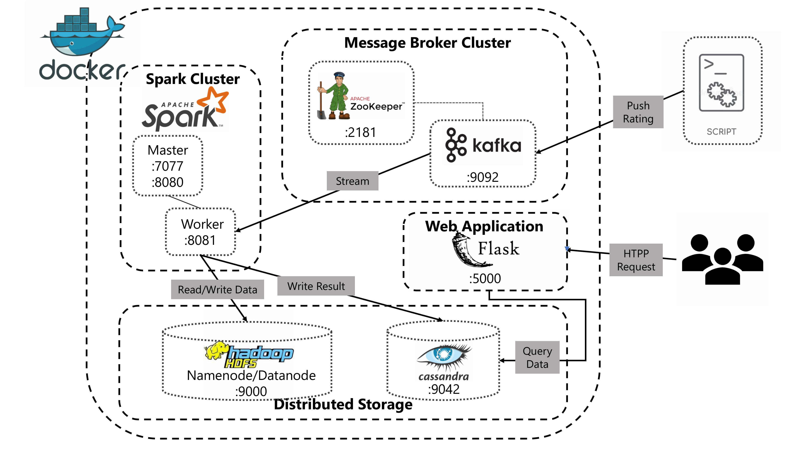

# Movie_Recommendation_System

## Table of Contents
- [1. Project Overview](#1-project-overview)
- [2. Use Case & Industry Background](#2-use-case--industry-background)
- [3. Dataset Overview](#3-dataset-overview)
- [4. System Architecture](#4-system-architecture)
- [5. Workflow Explanation](#5-workflow-explanation)
  - [Batch Processing](#batch-processing)
  - [Speed Processing](#speed-processing)
- [6. Repository Structure](#6-repository-structure)
- [7. Installation & Requirements](#7-installation--requirements)
- [8. How to Run the Project](#8-how-to-run-the-project)
- [9. Team Responsibilities](#9-team-responsibilities)
- [10. Acknowledgments](#10-acknowledgments)

---

# 1. Project Overview

This project is a **Movie Recommendation System** built entirely using **Big Data technologies**, designed under the **Lambda Architecture**.  
It combines:

- **Batch Layer** → Train ALS model on 32M MovieLens ratings (Spark MLlib)
- **Speed Layer** → Real-time recommendation updates via Kafka + Spark Streaming
- **Serving Layer** → Cassandra as low-latency data store
- **Web Demo** → Flask/Streamlit app for querying recommendations

The system outputs **Top-10 personalized movie recommendations** for every user, updated instantly when new ratings arrive.

---

# 2. Use Case & Industry Background
### **Use Case: Product/Content Recommendation Engine**
Recommendation systems are used by:
- Netflix  
- YouTube  
- Shopee  
- Spotify  
- TikTok  

### **Industries**
- E-commerce  
- Media Streaming  
- Social Networks  

### Big Data Frameworks Used
| Framework | Purpose |
|----------|----------|
| **Apache Spark** | Batch ETL + ALS model training |
| **Apache Kafka** | Ingest new user ratings in real-time |
| **Apache Flink** | (Optional extension) Real-time processing |
| **Hadoop MapReduce** | Large-scale offline preprocessing |
| **HDFS** | Distributed storage |
| **Cassandra** | Low-latency storage for recommendations |

---

# 3. Dataset Overview
📌 **Dataset: MovieLens 32M**  
📌 **Link:** https://www.kaggle.com/datasets/dattotien/bigdata-movies  

### Content
| File | Description |
|------|-------------|
| `ratings.csv` | 32M ratings (userId, movieId, rating, timestamp) |
| `movies.csv` | Movie details (movieId, title, genres) |
| `tags.csv` | 2M user-generated tags |
| `links.csv` | Mapping to IMDb, TMDB, MovieLens |

The dataset includes:
- ⭐ **32,000,000 ratings**
- 🎬 **87,585 movies**
- 👤 **200,000+ users**
- 🏷️ **2,000,000 tags**

Two versions included:
- `ml-1m` → For testing & debugging  
- `ml-32m` → Full-scale final processing  

---

# 4. System Architecture

The project implements the **Lambda Architecture** with 3 primary, complementary layers:

- **Batch Layer (HDFS, Spark MLlib):** Computes high-accuracy "Batch Views" (full historical model retraining).
- **Speed Layer (Kafka, Spark Streaming):** Processes new data streams to generate instant "Real-time Views".
- **Serving Layer (Cassandra):** Merges results from both layers, ensuring extremely low query latency.

---

# 5. Workflow Explanation

## <a name="batch-processing"></a>Batch Processing (Historical Layer)

1. **Ingestion:** Historical and accumulated data is stored in **HDFS**.
2. **Training:** **Spark MLlib** periodically retrains the **ALS** model on the entire dataset.
3. **Output:** Pre-calculated recommendations are written to **Cassandra** as the **Batch View**.

---

## <a name="speed-processing"></a>Speed Processing (Real-time Layer)

1. **Event Ingestion:** New user rating events are ingested through **Apache Kafka**.
2. **Inference:** **Spark Streaming** loads the ALS model and updates recommendations **only for users with new interactions**.
3. **Update:** Real-time recommendations are written instantly to **Cassandra** as the **Speed View**.

---

# 6. Repository Structure
```
Movie_Recommendation_System/
│
├── 📄 README.md                          # Main documentation
├── 📄 QUICK_START.md                     # Quick start guide
├── 📄 SETUP_GUIDE.md                     # Detailed setup guide
├── 📄 requirements.txt                   # List of Python libraries
├── 📄 docker-compose.yml                 # Docker Compose configuration
├── 📄 Dockerfile                         # Docker image configuration
├── 📄 core-site.xml                      # HDFS configuration
│
├── 📁 src/                               # Main source code
│   ├── 📁 batch/                         # Batch processing (Spark)
│   │   ├── __init__.py
│   │   ├── train_model.ipynb             # Model training notebook
│   │   ├── write_recommendations.py      # Writes recommendations to Cassandra
│   │   └── 📁 als_model_32m/             # Trained ALS model
│   │       ├── 📁 itemFactors/           # Movie factor matrix (100+ .parquet files)
│   │       ├── 📁 userFactors/           # User factor matrix (100+ .parquet files)
│   │       └── 📁 metadata/              # Model metadata
│   │
│   ├── 📁 online/                        # Online recommendations processing
│   │   ├── __init__.py
│   │   └── user_factor_utils.py          # Online computation utilities
│   │
│   ├── 📁 stream/                        # Streaming processing (Spark Streaming)
│   │   ├── __init__.py
│   │   └── process_stream.py             # Processes real-time ratings from Kafka
│   │
│   ├── 📁 utils/                         # General utilities
│   │   ├── __init__.py
│   │   └── cassandra_connector.py        # Cassandra connector
│   │
│   └── 📁 webapp/                        # Flask web application
│       ├── app.py                        # Main Flask application
│       ├── README.md                     # Webapp documentation
│       ├── 📁 static/                    # Static resources (CSS, JS, images)
│       └── 📁 templates/                 # HTML templates
│           ├── index.html                # Home page
│           └── movie_details.html        # Movie details page
│
├── 📁 scripts/                           # Utility scripts
│   ├── setup_env.sh                      # Environment setup
│   ├── load_to_hdfs.sh                   # Load data to HDFS
│   ├── push_model_to_hdfs.py             # Push model to HDFS
│   ├── check_and_push_model.sh           # Check and push model
│   ├── kafka_producer.py                 # Producer sends data to Kafka
│
│
├── 📁 notebooks/                         # Jupyter Notebooks
│   └── 01-EDA-MovieLens.ipynb           # MovieLens data analysis
│
├── 📁 data/                              # Input data
│   ├── 📁 ml-1m/                         # MovieLens 1M Dataset
│   │   └── 📁 ml-1m/
│   └── 📁 ml-32m/                        # MovieLens 32M Dataset
│       └── 📁 ml-32m/
│
└── 📁 cassandra_data_storage/            # Cassandra data (persistent)
    ├── 📁 commitlog/                     # Commit logs
    ├── 📁 data/                          # Cassandra data
    │   ├── 📁 movie_recs/                # Recommendations keyspace
    │   │   └── 📁 user_recommendations-*/ # user_recommendations table
    │   ├── 📁 system/                    # Cassandra system
    │   ├── 📁 system_auth/               # Authentication
    │   ├── 📁 system_distributed/        # Distributed system
    │   ├── 📁 system_schema/             # Schema metadata
    │   └── 📁 system_traces/             # Traces
    └── 📁 saved_caches/                  # Saved caches
```       


---

# 7. Installation & Requirements
The entire ecosystem is **Dockerized** using `docker-compose.yml`.

**Prerequisites:**
1.  Docker Engine
2.  Docker Compose
3.  Resource Recommendation: Minimum 16GB RAM (required for Spark's In-memory processing).

---

# 8. How to Run the Project
Follow these steps to set up and start the complete Movie Recommendation System, which includes batch processing, real-time streaming, and the Flask web application.
1.  **Clone the repository.** 
`git clone <REPOSITORY_URL>`, 
`cd Movie_Recommendation_System`
2.  **Start the Cluster:** Execute `docker-compose up -d`.
3.  **Ingest Data:** Run the ingestion script: `./scripts/load_to_hdfs.sh`.
4.  **Run Batch Job:** Execute the Spark Batch training process. `docker compose exec app bash`
  - Run the Spark Batch job to write initial recommendations `spark-submit /app/src/batch/write_recommendations.py`
5. **Run Web App:** Launch the Flask application to query recommendations.
    - Enter the application container `docker compose exec app bash` `python3 src/webapp/app.py`
    - After testing the web application and creating a user rating, that rating will be emitted to the stream (Kafka).
6.  **Run Streaming Job:** Start the Spark Streaming process.
  - Enter the application container `docker compose exec app bash`
  - Navigate to the app directory inside the container `cd /app`
  - Run the Spark Streaming job with required packages `spark-submit \--packages \org.apache.spark:spark-sql-kafka-0-10_2.12:3.4.1,\com.datastax.spark:spark-cassandra-connector-assembly_2.12:3.3.0 \src/stream/process_stream.py`
  - ⚠️ KEEP THIS TERMINAL RUNNING! Do NOT close it while the system is in use.
---
The system is fully operational. Access the web interface at: http://127.0.0.1:5000/
# 9. Team Responsibilities

| Name | Responsibilities |
|:---:|:---|
| **Tô Tiến Đạt** | Cassandra Schema Design, Spark-to-Cassandra connection module, Flask Web Application development |
| **Phạm Hà Anh** | Data Analysis (EDA) on MovieLens, Data Ingestion script (ETL to HDFS), **Spark Batch** module development (ALS training) |
| **Chu Thị Phương Anh** | Apache Kafka cluster configuration, **Producer** script for real-time rating stream, **Spark Streaming** module development. |

---

# 10. Acknowledgments
We acknowledge the pioneering work of **Nathan Marz** (Lambda Architecture) and **GroupLens Research** (MovieLens Dataset). Special thanks to Dr. Trần Hồng Việt for guidance.

---
